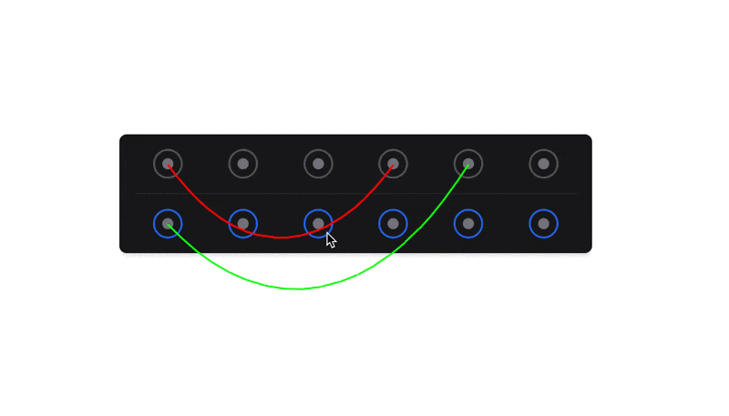

# Patchbay.js




JavaScript library for creating interactive physics-based rope simulations connected to DOM
elements.

Inspired
by [Reason Studio's Rack](https://www.reasonstudios.com/rack#:~:text=hear%20what%20happens.-,FLIP%20THE%20RACK,-Scary%20to%20some) ([Video](https://www.reasonstudios.com/videos/Flip-the-rack.mp4)).

## Installation

```shell
npm install patchbay.js

# Or with yarn
yarn add patchbay.js
```

## Configuration Options

| Option             | Type    | Default            | Description                                                                                                 |
| ------------------ | ------- | ------------------ | ----------------------------------------------------------------------------------------------------------- |
| color              | string  | "#000000"          | The color of the cable.                                                                                     |
| dragHandleSize     | number  | 25                 | The size of the drag handles in pixels.                                                                     |
| gravity            | number  | 1                  | The gravity factor applied to the cable. Higher values make the cable sag more.                             |
| iterations         | number  | 5                  | The number of iterations to solve constraints. Higher values increase stability but may impact performance. |
| lineThickness      | number  | 2                  | The thickness of the cable line in pixels.                                                                  |
| segments           | number  | 20                 | The number of segments in the cable. More segments allow for smoother curves but may impact performance.    |
| slack              | number  | 1.1                | The slack factor of the cable. Values greater than 1 allow the cable to hang loosely.                       |
| snapRadius         | number  | 100                | The radius (in pixels) for snapping to connector elements when dragging cable ends.                         |
| snapTargetSelector | string  | ".cable-connector" | The CSS selector for identifying snap target elements.                                                      |
| draggable          | boolean | true               | Whether the cable start/end points are draggable by the user.                                               |

### Usage Example

```javascript
import { Patchbay } from "patchbay.js";

const patchbay = new Patchbay({
  // Global configuration for all cables
  color: "#FF0000",
  gravity: 1.5,
  segments: 30,
  draggable: true,
});

patchbay.connect(document.getElementById("input-1"), document.getElementById("output-2"), {
  // Specific configuration for this cable, overriding global settings
  color: "#00FF00",
  slack: 1.2,
  snapRadius: 150,
});

patchbay.start();
```

### Snapping to HTML Elements when Dragging

Patchbay.js supports snapping to HTML elements when dragging cable ends. To enable this feature, set the
`snapTargetSelector` option to a valid CSS selector for the elements you want to snap to. Patchbay.js will automatically
snap the cable end points to the nearest element when dragging.

```html
Snap here
<div id="start" class="cable-connector"></div>

and here initially.
<div id="end" class="cable-connector"></div>

And if you drag the cable ends close to these elements, it will snap to them.
<div id="snap-here-on-drag" class="cable-connector"></div>

<script>
  const patchbay = new Patchbay({
    // Selector to snap elements to when releasing the cable ends after dragging
    snapTargetSelector: ".cable-connector",
  });

  const start = document.getElementById("start");
  const end = document.getElementById("end");
  patchbay.connect(start, end);
  patchbay.start();
</script>
```

## Examples

Check out the [examples](./examples) directory for some examples of how to use Patchbay.js.

## Development

To set up the development environment:

1. Clone the repository
2. Run `npm install` to install dependencies
3. Run `npm run build` to build the library for production

```shell
git clone git@github.com:HelgeSverre/patchbay-js.git
cd patchbay-js
npm install
npm run build
```

### Formatting

This project uses [Prettier](https://prettier.io/) for code formatting. To format the code, run:

```shell
npm run format
```

## Contributing

Contributions are welcome! Please feel free to submit a Pull Request.

## 📝 License

This project is [MIT](https://opensource.org/licenses/MIT) licensed.
